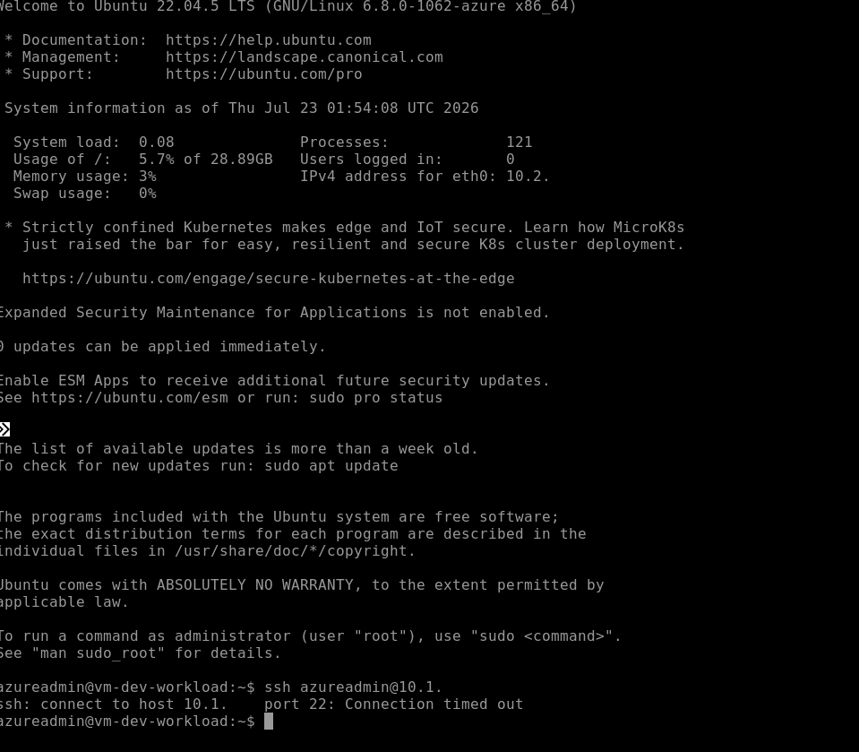
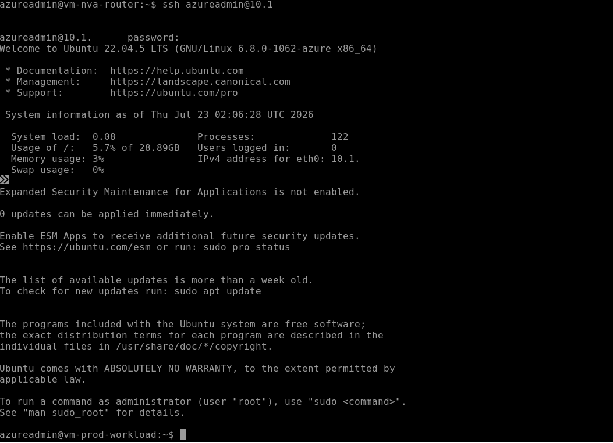

# Azure Hub-and-Spoke Network Architecture (Terraform)

## Overview

This repository contains the Infrastructure as Code (IaC) used to deploy a hub-and-spoke network topology in Microsoft Azure. The architecture follows the hub-and-spoke pattern recommended by the [Azure Cloud Adoption Framework](https://learn.microsoft.com/en-us/azure/cloud-adoption-framework/ready/azure-best-practices/hub-spoke-network-topology), adapted and extended with a custom Network Virtual Appliance (NVA), User-Defined Routes, and NSG-based access control to demonstrate centralized traffic routing and least-privilege network security.

## Architecture Components

- **Hub Virtual Network** — Central network hosting shared infrastructure: the NVA, Azure Bastion, and a reserved subnet for a future VPN Gateway.
- **Spoke Virtual Networks** — Isolated `Production` and `Development` environments, each connected to the Hub via VNet Peering.
- **Network Virtual Appliance (NVA)** — A small Ubuntu 22.04 LTS virtual machine configured as a custom router, standing in for a commercial firewall appliance. IP forwarding is enabled both at the Azure network layer (`ip_forwarding_enabled`) and at the Linux kernel level (`net.ipv4.ip_forward`), since Azure VNet peering is non-transitive and spoke-to-spoke traffic requires an explicit routing point.
- **User-Defined Routes (UDRs)** — Custom route tables applied to both spoke subnets, forcing all inter-spoke traffic through the NVA's static IP instead of Azure's default routing.
- **Azure Bastion** — Provides secure, browser-based access to VMs with no public IP addresses, eliminating direct SSH/RDP exposure to the internet.
- **Network Security Group (NSG)** — Applied to the Production subnet, allowing SSH only from the Hub network (`10.0.0.0/16`) and explicitly denying all other inbound traffic.

## Technologies Used

- **Infrastructure as Code:** Terraform (HCL)
- **Cloud Provider:** Microsoft Azure (Networking & Compute)
- **OS & Tooling:** Linux (Ubuntu 22.04 LTS), Bash, Azure CLI
- **Version Control:** Git & GitHub

## Key Engineering Challenges Solved

1. **Diagnosing Azure Capacity and Quota Constraints**
   Deployment of the NVA VM initially failed across multiple VM sizes and families (`Standard_B1s`, `Standard_B2s`, `Standard_DS1_v2`, `Standard_A2_v2`, `Standard_Fasv6`, `Standard_D1_v2`) due to a combination of regional hardware capacity shortages (`SkuNotAvailable`) and subscription-level core quota limits, including a total regional vCPU cap. Used the Azure CLI (`az vm list-skus`, `az vm list-usage`) to directly query available SKUs and quota allocations, ultimately identifying `Standard_D2_v3` as a size with both available capacity and headroom in an unused quota family.

2. **Resolving a Hypervisor Generation Mismatch**
   A newer-generation VM size (`Standard_F2as_v6`) failed to boot because it required a Gen2 (UEFI) image, while the deployed Ubuntu image defaulted to Gen1 (BIOS). Rather than switching image generations, selected a Gen1-compatible VM size to match the existing image reference.

3. **Diagnosing an Undocumented Regional Policy Restriction**
   Attempts to deploy in `eastus2` and `centralus` failed with `RequestDisallowedByAzure`. Investigated the subscription's Azure Policy assignments directly in the Azure Portal and found a `listOfAllowedLocations` policy restricting deployment to five specific regions — a restriction applied at the institutional (school) subscription level, not documented in the deployment errors themselves.

4. **Recovering from Terraform State Desynchronization**
   A deployment crash mid-`apply` left the local Terraform state out of sync with Azure after a VNet peering resource had already been created successfully. Rather than deleting and recreating the resource, used `terraform import` to reconcile the state file with the existing infrastructure, avoiding unnecessary changes to live resources.

5. **Secure Credential Management**
   Refactored hardcoded VM admin passwords into a Terraform variable (`sensitive = true`), sourced from a local `terraform.tfvars` file excluded via `.gitignore`. Verified exclusion using `git check-ignore` and confirmed via `git status` before the first commit that no state files, `.tfvars` files, or plaintext credentials were staged.

## Validation & Testing

To confirm the routing and security design functioned as intended (not just that resources deployed successfully), connectivity was tested via Azure Bastion.

**Test 1: NSG Correctly Blocks Unauthorized Lateral Traffic**
- **Action:** Attempted SSH directly from the `Dev Workload` VM to the `Prod Workload` VM's private IP.
- **Result:** Connection timed out. Since the Dev subnet is outside the Hub's address range, the NSG's implicit deny silently dropped the traffic — no explicit `Allow` rule matched the source.

**Test 2: Authorized Traffic Successfully Routes Through the Hub**
- **Action:** Attempted SSH from the `NVA Router` (Hub, `10.0.1.10`) to the `Prod Workload` VM's private IP.
- **Result:** Success — the NSG's `Allow-SSH-From-Hub` rule matched the Hub's source address range, and the session was established.

Together, these two tests confirm the NSG is enforcing least-privilege access as designed: traffic is permitted only from the trusted Hub network, and blocked from other spokes by default.

## Known Limitations / Next Steps

This project is a working lab demonstration, not a production-hardened deployment. Known gaps:

- Password-based SSH authentication is used for simplicity; SSH key-based authentication is the standard production practice.
- The NSG is currently applied only to the Production subnet; the Development subnet has no NSG.
- No outbound traffic rules are defined; only inbound is explicitly controlled.
- IP forwarding on the NVA's Linux OS was configured manually via SSH rather than through Terraform-managed automation (e.g., cloud-init).
- All resources are deployed within a single resource group and region; no tagging or output values are currently defined.

## Deployment Instructions

1. Clone this repository.
2. Create a `terraform.tfvars` file and define your own `admin_password` value (see `terraform.tfvars.example` for the expected format).
3. Authenticate to Azure via the Azure CLI: `az login`
4. Initialize the working directory: `terraform init`
5. Review the execution plan: `terraform plan`
6. Deploy the infrastructure: `terraform apply`
7. Destroy resources when finished to avoid ongoing costs: `terraform destroy`
